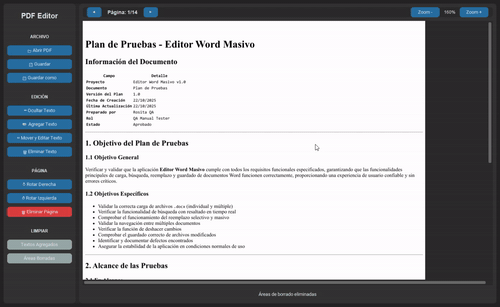
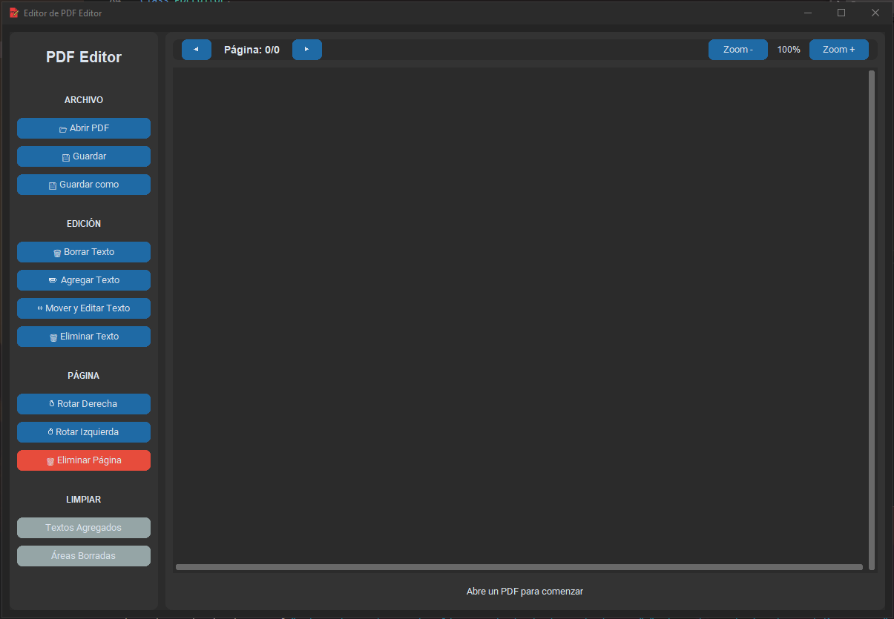
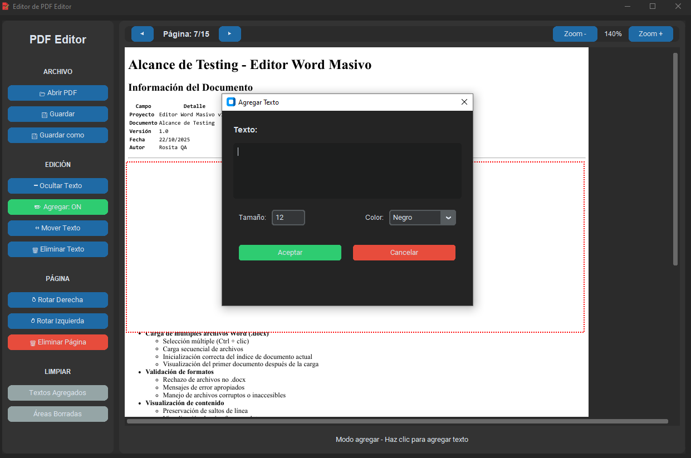
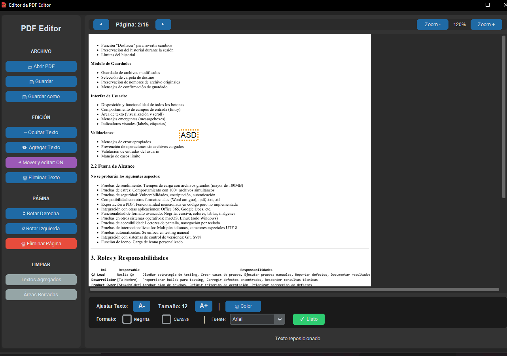
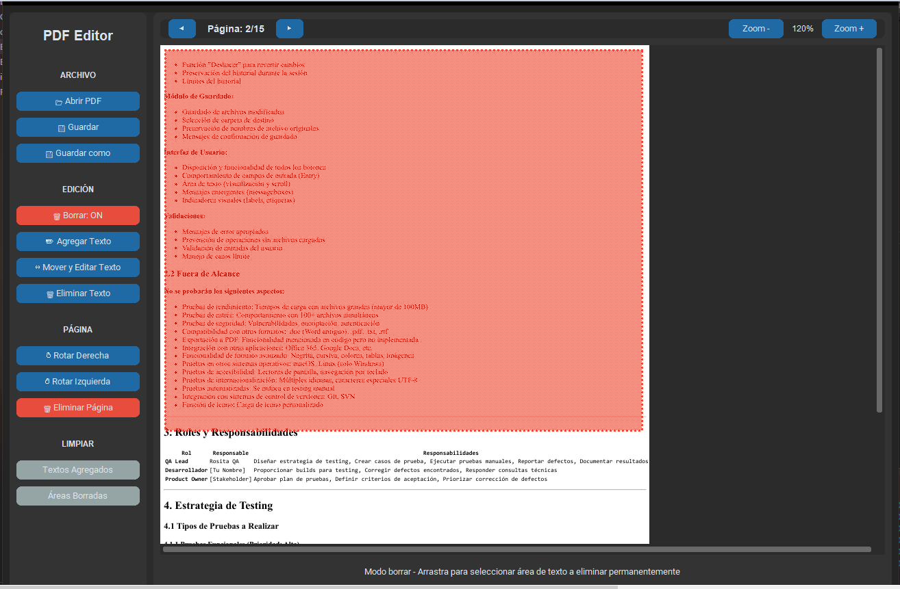

# PDF Editor

Un editor de PDF completo y profesional desarrollado en Python que permite agregar, editar, mover y eliminar texto en documentos PDF, además de funciones avanzadas de manipulación de páginas.

## Descripción

PDF Editor es una aplicación de escritorio que facilita la edición de documentos PDF sin necesidad de software costoso. Ofrece una interfaz intuitiva con tema oscuro y múltiples herramientas para modificar textos y páginas de manera eficiente.

## Ejemplo



## Características Principales

### Edición de Texto
- Agregar texto personalizado en cualquier posición del documento
- Ajustar tamaño de fuente dinámicamente (6-144 puntos)
- Paleta de 8 colores para el texto
- Aplicar formato: Negrita e Itálica
- Selección entre 5 fuentes tipográficas
- Mover y reposicionar textos mediante arrastre
- Eliminar textos agregados individualmente

### Manipulación de Contenido Original
- Borrar permanentemente áreas de texto del PDF original
- Redacción de información sensible mediante selección de áreas
- Vista previa de áreas marcadas antes de aplicar cambios definitivos
- Aplicación de cambios solo al guardar el documento

### Gestión de Páginas
- Rotar páginas en incrementos de 90 grados (derecha/izquierda)
- Eliminar páginas específicas del documento
- Navegación fluida entre páginas con indicadores visuales
- Sistema de zoom ajustable (50% - 300%)

### Interfaz de Usuario
- Diseño moderno con tema oscuro
- Panel lateral con controles organizados por categorías
- Modos de edición con indicadores visuales claros
- Panel de controles contextuales para ajustes precisos
- Barra de estado con información en tiempo real
- Sistema de scrolling horizontal y vertical

## Requisitos del Sistema

### Para ejecutar el archivo .exe:
- Windows 10 o superior
- 4 GB de RAM mínimo
- 50 MB de espacio en disco

### Para ejecutar desde código fuente:
- Python 3.8 o superior
- Pip (gestor de paquetes de Python)
- Sistema operativo: Windows, Linux o macOS

## Instalación

### Opción 1: Ejecutable para Windows

1. Descarga el archivo `PDF_Editor.exe` desde Releases
2. Ejecuta el archivo directamente
3. No requiere instalación ni dependencias adicionales

### Opción 2: Ejecución desde código fuente

1. Clona este repositorio:
```bash
git clone https://github.com/rosafg/PDF-Editor.git
cd PDF-Editor
```

2. Instala las dependencias necesarias:
```bash
pip install -r requirements.txt
```

3. Ejecuta la aplicación:
```bash
python src/Editor_PDF.py
```

## Dependencias

El proyecto utiliza las siguientes bibliotecas:

```
customtkinter==5.2.1    # Interfaz gráfica moderna
PyMuPDF==1.23.8         # Manipulación de archivos PDF
Pillow==10.1.0          # Procesamiento de imágenes
```

## Guía de Uso Rápido

### 1. Abrir un documento PDF
- Clic en el botón "Abrir PDF" en el panel lateral
- Selecciona tu archivo desde el explorador
- El documento se cargará automáticamente

### 2. Agregar texto nuevo
- Activa el modo "Agregar Texto" (botón se vuelve verde)
- Haz clic en la posición donde deseas insertar texto
- Ingresa el contenido en el diálogo que aparece
- Configura tamaño y color según tus necesidades
- Confirma con "Aceptar"

### 3. Mover y editar texto agregado
- Activa el modo "Mover Texto" (botón se vuelve morado)
- Haz clic en un texto para seleccionarlo
- Arrastra para reposicionar
- Usa la rueda del ratón para ajustar el tamaño
- Modifica propiedades en el panel de controles que aparece

### 4. Borrar texto del PDF original
- Activa el modo "Borrar Texto" (botón se vuelve rojo)
- Haz clic y arrastra para seleccionar el área a eliminar
- El área se marcará visualmente
- Los cambios se aplicarán permanentemente al guardar

### 5. Guardar cambios
- "Guardar": Sobrescribe el archivo original
- "Guardar como": Crea un nuevo archivo PDF con las modificaciones

## Estructura del Proyecto

```
PDF-Editor/
│
├── assets/
│   ├── screenshots/           # Capturas de pantalla
│   │   ├── main_interface.png
│   │   ├── add_text.png
│   │   ├── move_text.png
│   │   └── delete_mode.png
│   └── icon.ico              # Icono de la aplicación
│
├── docs/
│   └── USER_GUIDE.md         # Documentación detallada
│
├── .gitignore                # Archivos excluidos del repositorio
├── README.md                 # Este archivo
├── LICENSE                   # Licencia MIT
└── requirements.txt          # Dependencias del proyecto
```

## Tecnologías Utilizadas

- **Python 3.8+**: Lenguaje de programación principal
- **CustomTkinter**: Framework para crear interfaces gráficas modernas
- **PyMuPDF (fitz)**: Biblioteca para leer y modificar archivos PDF
- **Pillow (PIL)**: Procesamiento y manipulación de imágenes
- **Tkinter**: Base del sistema de interfaz gráfica

## Capturas de Pantalla

### Interfaz Principal

*Vista general de la aplicación con un documento PDF cargado*

### Diálogo de Agregar Texto

*Ventana de configuración para insertar nuevo texto*

### Modo Mover y Editar Texto

*Panel de controles para ajustar texto seleccionado*

### Modo Borrar Área

*Selección de área para eliminación permanente*

## Características Avanzadas

### Sistema de Modos
La aplicación utiliza modos exclusivos para cada tipo de operación:
- Solo un modo puede estar activo a la vez
- Indicadores visuales claros del modo actual
- Cursor específico para cada modo de operación

### Panel de Controles Contextual
Al seleccionar texto en modo "Mover", aparece un panel con:
- Ajuste de tamaño mediante botones A- y A+
- Selector de color con 8 opciones
- Activación de negrita e itálica
- Selector de familia tipográfica
- Confirmación de cambios

### Gestión de Cambios
- Los cambios se visualizan inmediatamente en pantalla
- Las modificaciones permanentes se aplican solo al guardar
- Función de limpieza por página antes de guardar
- Capacidad de deshacer marcas antes del guardado final

## Limitaciones Conocidas

- Las modificaciones son permanentes después de guardar (se recomienda trabajar con copias)
- El modo borrar elimina todo el contenido en el área rectangular seleccionada
- Las fuentes están limitadas a las 5 disponibles en el sistema
- No incluye función de deshacer/rehacer durante la sesión
- El ejecutable está optimizado solo para Windows

## Desarrollo Futuro

Características planeadas para versiones posteriores:

- Soporte para insertar y editar imágenes
- Sistema de deshacer/rehacer con historial
- Exportación de páginas individuales como imágenes
- Combinación de múltiples archivos PDF
- Adición de marcas de agua personalizadas
- Soporte para firmas digitales
- Compresión de archivos PDF
- Extracción de texto y búsqueda

## Contribuciones

Las contribuciones son bienvenidas y apreciadas. Para contribuir:

1. Haz un Fork del repositorio
2. Crea una rama para tu característica:
   ```bash
   git checkout -b feature/nueva-funcionalidad
   ```
3. Realiza tus cambios y haz commit:
   ```bash
   git commit -m 'Agregar: descripción de la nueva funcionalidad'
   ```
4. Sube los cambios a tu rama:
   ```bash
   git push origin feature/nueva-funcionalidad
   ```
5. Abre un Pull Request con descripción detallada

### Pautas para Contribuciones
- Mantén el código limpio y documentado
- Sigue las convenciones de estilo PEP 8
- Agrega comentarios en español para consistencia
- Prueba todas las funcionalidades antes de enviar
- Actualiza la documentación si es necesario

## Reportar Problemas

Si encuentras algún bug o tienes sugerencias:

1. Revisa si el problema ya fue reportado en Issues
2. Crea un nuevo Issue con:
   - Descripción clara del problema
   - Pasos para reproducirlo
   - Comportamiento esperado vs actual
   - Capturas de pantalla si aplica
   - Información del sistema (SO, versión Python)

## Licencia

Este proyecto está bajo la Licencia MIT. Consulta el archivo [LICENSE](LICENSE) para más detalles.

### Resumen de la Licencia
- Uso comercial y privado permitido
- Modificación y distribución permitida
- Sin garantía
- Atribución requerida

## Autor

**Tu Nombre**
- GitHub: [RosaFG](https://github.com/rosafg)
- LinkedIn: [rosafg](https://linkedin.com/in/rosafg)
- Email: rosafuegos@gmail.com

## Agradecimientos

- **CustomTkinter**: Por proporcionar una biblioteca moderna para interfaces gráficas
- **PyMuPDF**: Por las excelentes capacidades de manipulación de PDF
- **Comunidad Python**: Por el soporte continuo y recursos educativos
- **Contribuidores**: Gracias a todos los que han aportado al proyecto

## Estado del Proyecto


---

**Desarrollado con Python** | **2025**

Si este proyecto te resulta útil, considera darle una estrella en GitHub.
